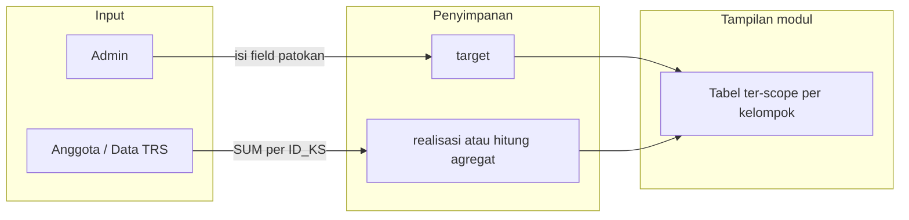

# Modul Target & Realisasi — Tujuan dan Konsep

Dokumen ini merangkum **mengapa** modul Target & Realisasi dibuat, **bagaimana** data target dan realisasi saling berhubungan, dan **field apa saja** yang menjadi acuan tampilan di tabel.  
Berdasarkan catatan stakeholder di `plans/realisasi-dan-target.md` dan kebutuhan Modul 3.

> Dokumen terkait:  
> - `plans/modul-target-realisasi-field-patokan.md` — daftar field sama di `target`, `realisasi`, `data_trs`  
> - `plans/modul-target-realisasi-penjelasan-kebutuhan.md` — kebutuhan bisnis (%, status, UI)  
> - `plans/realisasi-dan-target.md` — catatan awal (informal)

---

## 1. Tujuan modul dibuat

### 1.1 Masalah yang ingin diselesaikan

Kelompok Sahabat Obor Mas perlu cara yang **terpusat** untuk:

1. **Menetapkan target** capaian (per kelompok, per periode) pada berbagai komponen simpanan, pinjaman, dan asuransi — bukan hanya satu angka total.
2. **Membandingkan** target tersebut dengan **capaian aktual** yang berasal dari transaksi anggota (Data TRS), tanpa admin mengetik ulang realisasi manual.
3. **Memantau** progres (persentase, status On Target / Belum On Target) di **Admin Web**, **Admin Mobile**, dan **User Mobile** — admin melihat banyak kelompok, user melihat kelompoknya sendiri.

### 1.2 Tujuan utama (ringkas)

| Tujuan | Keterangan |
|--------|------------|
| **Perencanaan** | Admin mengisi **target** per kelompok pada field-field yang disepakati (patokan Data Target). |
| **Pelacakan otomatis** | **Realisasi** terisi dari agregasi Data TRS anggota dalam kelompok yang sama — field realisasi **mengikuti pola field target**. |
| **Monitoring** | Tabel/kartu modul menampilkan data yang **sudah di-scope** (per kelompok; user hanya kelompok sendiri). |
| **Transparansi** | Anggota dapat melihat seberapa jauh kelompoknya mencapai target tanpa mengubah angka target. |

Modul ini **bukan** modul input transaksi harian (itu Data TRS). Modul ini **bukan** duplikasi CRUD master kelompok. Modul ini adalah **lapisan perbandingan target vs capaian agregat**.

---

## 2. Konsep inti: dua lapisan data

```text
┌─────────────────────────────────────────────────────────────┐
│  DATA TARGET (input admin)                                   │
│  Satu baris per: ID_KS + TGL_TGT                             │
│  Berisi nilai TARGET per field patokan (STR_SP, STR_SW, …)   │
└───────────────────────────┬─────────────────────────────────┘
                            │ dibandingkan
                            ▼
┌─────────────────────────────────────────────────────────────┐
│  DATA REALISASI (otomatis / agregat)                         │
│  Satu baris per: KELompok (ID_KS) + periode (TGL_TGT)      │
│  Nilai = penjumlahan field TRS anggota dalam kelompok itu    │
│  Nama kolom realisasi = sama dengan patokan target           │
└───────────────────────────┬─────────────────────────────────┘
                            │ sumber per anggota
                            ▼
┌─────────────────────────────────────────────────────────────┐
│  DATA TRS (transaksi per anggota)                            │
│  Banyak baris per NO_AGT (user A, user B, …)                 │
│  Field yang namanya sama dengan patokan target dijumlahkan   │
└─────────────────────────────────────────────────────────────┘
```

### 2.1 Data Target — apa dan siapa mengisi

**Data Target** adalah **rencana / angka yang diharapkan** untuk satu kelompok pada periode tertentu.

- **Diisi oleh:** admin (Web Admin / Admin Mobile).
- **Disimpan di:** tabel `target` (kolom fisik mengikuti field patokan).
- **Bukan** diisi oleh anggota/user.

**Field input target (patokan):**

| Field | Arti |
|-------|------|
| `ID_KS` | ID Kelompok Sahabat |
| `TGL_TGT` | Tanggal / periode target |
| `JLH_AGT_BR` | Jumlah anggota baru (target) |
| `STR_SP` | Setoran Simpanan Pokok |
| `STR_SW` | Setoran Simpanan Wajib |
| `STR_SHR` | Setoran Simpanan Hari Raya |
| `STR_SMD` | Setoran Simpanan Masa Depan |
| `STR_SPD` | Setoran Simpanan Pendidikan |
| `STR_SBJ` | Setoran Simpanan Berjangka |
| `STR_SRY` | Setoran Simpanan Raya |
| `STR_SKA` | Setoran Simpanan Khusus Anggota |
| `PCR_PJM` | Pencairan Pinjaman |
| `BNG_PJM` | Bunga Pinjaman |
| `ASR_PKK` | Asuransi Pokok |

Admin mengisi **field-field ini** saat menambah/mengubah target kelompok (form **Tambah** / **Ubah** di Web Admin).

### 2.2 Data Realisasi — apa dan dari mana

**Data Realisasi** adalah **capaian aktual** kelompok, **bukan** form input terpisah yang diketik admin.

Alur bisnis (sesuai catatan `realisasi-dan-target.md`):

1. Setiap **anggota** punya transaksi di **Data TRS** (misalnya user A, user B).
2. Anggota A dan B tergabung dalam **satu kelompok** (misalnya Kelompok A) lewat `anggota.ID_KS`.
3. Untuk **setiap field patokan** yang ada di TRS dengan **nama sama** (mis. `STR_SP`, `STR_SW`, …), sistem **menjumlahkan** nilai dari semua anggota kelompok tersebut.
4. Hasil agregat per kelompok itulah yang tampil sebagai **realisasi** — **satu baris per kelompok**, dengan **kolom-kolom yang sama** seperti di Data Target.

**Contoh mental:**

```text
Kelompok A
├── User A  → TRS: STR_SP = 200.000, STR_SW = 100.000, …
├── User B  → TRS: STR_SP = 300.000, STR_SW = 150.000, …
└── Realisasi Kelompok A (agregat):
      STR_SP = 500.000
      STR_SW = 250.000
      … (per field patokan yang bisa dijumlah dari TRS)
```

**Patokan nama field:** realisasi **selalu mengikuti pola field Data Target** — kolom yang dibandingkan target vs realisasi **harus selaras** (nama sama di tabel `realisasi` jika disimpan snapshot; atau hasil hitung dengan nama field yang sama saat ditampilkan di modul).

### 2.3 Data TRS — peran dalam modul

**Data TRS** adalah **sumber kebenaran transaksi** per anggota.

- Modul Target & Realisasi **tidak menggantikan** input TRS.
- Modul ini **membaca** TRS, mengelompokkan per `ID_KS`, lalu mengisi komponen **realisasi**.
- Hanya field TRS yang **namanya sama** dengan patokan target yang masuk agregasi otomatis (detail: `modul-target-realisasi-field-patokan.md` §2.3).

---

## 3. Apa yang muncul di tabel modul (data ter-scope)

Data yang tampil di halaman **Target & Realisasi** (Web Admin / Mobile) adalah data yang **sudah di-scope**:

| Role | Scope |
|------|--------|
| **Admin** | Ringkasan **per kelompok** (semua kelompok di master / yang dikembalikan API summary). |
| **User (anggota)** | **Satu kelompok** milik akun yang login (`target-realisasi/me`). |

Setiap **baris tabel** (admin) atau **satu kartu** (user) pada dasarnya menampilkan:

- Identitas kelompok (`ID_KS` / nama kelompok, jumlah anggota).
- Nilai **target** per komponen patokan (dari input admin).
- Nilai **realisasi** per komponen patokan (dari agregat TRS).
- Turunan: persentase, status, progress bar (jika UI menampilkan agregat atau per komponen — keputusan tampilan fase berikutnya).

**Penting:** yang ditampilkan **bukan** daftar mentah per user A / user B di tabel utama modul ini — melainkan **satu baris per kelompok** hasil agregasi. Detail per anggota tetap di modul Data TRS / master anggota.

---

## 4. Mengapa target dan realisasi dipisah sebagai “modul”

| Aspek | Tanpa modul terpisah | Dengan modul Target & Realisasi |
|--------|----------------------|----------------------------------|
| Target vs aktual | Admin harus hitung manual dari TRS | Sistem agregat TRS → realisasi otomatis |
| Standar field | Bisa tidak konsisten antar laporan | Satu **patokan field** (Data Target) |
| Akses role | Sulit dibedakan input vs lihat saja | Admin input target; user hanya monitor |
| Periode | Tercampur dengan transaksi harian | `TGL_TGT` memisahkan periode target |

Modul ini memberi **satu tempat** untuk kebijakan capaian kelompok, terpisah dari:

- **Data TRS** (transaksi per anggota),
- **Master Kelompok Sahabat** (data induk kelompok),
- **Dashboard join lama** `target` + `realisasi` (jika masih ada di legacy, bukan pola monitoring baru berbasis TRS).

---

## 5. Alur kerja bisnis (end-to-end)



1. Admin buka modul → **Tambah/Ubah target** → isi field patokan → simpan ke `target`.
2. Anggota / operasional mengisi **Data TRS** (transaksi per `NO_AGT`).
3. Sistem (backend) mengagregasi TRS per kelompok → nilai **realisasi** per field patokan.
4. Modul menampilkan perbandingan target vs realisasi (+ % dan status).
5. User anggota membuka modul yang sama (scope satu kelompok) tanpa bisa mengubah target.

---

## 6. Prinsip patokan field (dari catatan stakeholder)

> *"Patokan fieldnya nanti itu berdasarkan field pattern dari data target."*

Artinya:

1. **Daftar field Data Target** (§2.1) adalah **master list** kolom bisnis modul ini.
2. **Realisasi** menggunakan **nama kolom yang sama** untuk perbandingan apple-to-apple.
3. **TRS** menyumbang realisasi hanya pada kolom yang **namanya identik** dengan patokan (mis. `STR_SP` … `STR_SKA`); kolom dengan nama berbeda (`STR_PJM` vs `PCR_PJM`) perlu keputusan pemetaan — lihat dokumen patokan.

---

## 7. Perbedaan singkat: tabel `realisasi` vs “realisasi” sebagai konsep

| Istilah | Makna dalam modul ini |
|---------|------------------------|
| **Realisasi (konsep)** | Capaian agregat per kelompok dari TRS, field mengikuti patokan target. |
| **Tabel `realisasi` (DB)** | Tabel legacy/snapshot per `ID_KS` + `TGL_TGT`; kolomnya **selaras nama** dengan patokan target. Implementasi monitoring **bisa** menulis/membaca tabel ini **atau** menghitung langsung dari TRS saat tampil — keputusan teknis di fase implementasi. |

Yang penting bagi produk: **user tidak mengisi realisasi manual** di form modul; yang diisi admin hanya **target**.

---

## 8. Manfaat untuk pengguna

### Admin

- Menetapkan target multi-komponen per kelompok dan periode.
- Melihat capaian aktual tanpa rekap manual dari TRS.
- Mengidentifikasi kelompok yang belum On Target.

### User (anggota)

- Melihat performa **kelompoknya** terhadap target yang ditetapkan pengurus.
- Memahami kontribusi kolektif (realisasi kelompok), bukan mengelola target.

---

## 9. Ruang lingkup vs di luar modul

**Termasuk:**

- Input target (field patokan).
- Agregasi realisasi dari TRS per kelompok.
- Tampilan monitoring ter-scope (admin / user).
- Persentase dan status capaian.

**Di luar / modul lain:**

- CRUD transaksi TRS per anggota.
- CRUD master kelompok, ketua, sekretaris, dll.
- Input manual nilai realisasi per field (kecuali kebijakan bisnis berubah).

---

## 10. Status dokumentasi & implementasi

| Dokumen | Fokus |
|---------|--------|
| `realisasi-dan-target.md` | Catatan konsep awal (informal) |
| **Dokumen ini** | Tujuan modul + konsep target / realisasi / TRS |
| `modul-target-realisasi-field-patokan.md` | Field sama di DB `target`, `realisasi`, `data_trs` |
| `modul-target-realisasi-penjelasan-kebutuhan.md` | Requirements Modul 3 (%, status, visualisasi) |

**Implementasi kode saat ini** (referensi): masih terbatas pada monitoring **satu nominal** (`STR_SP`) per kelompok; perluasan ke **seluruh field patokan** §2.1 mengikuti dokumen ini dan `field-patokan.md`.

---

## 11. Ringkasan satu kalimat

**Modul Target & Realisasi** dibuat agar admin dapat **menetapkan target** per kelompok pada field-field standar, sementara **realisasi terisi otomatis** dari penjumlahan Data TRS anggota dalam kelompok yang sama — lalu keduanya ditampilkan ter-scope di satu layar monitoring untuk admin dan anggota.
